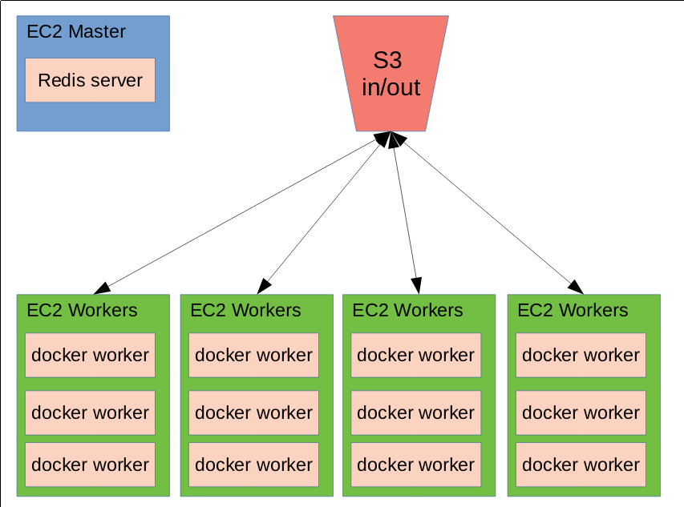

# working example of our current image processing setup

* [redis](https://redis.io/) server (running in Docker)
* [python-rq](https://python-rq.org/) job queuing system
* Docker workers to actually execute the jobs from redis/rq

**Problem**: does not scale well (manual startup/setup  of additional EC2 instances,
startup of Docker workers)

**Solution**: use AWS ECS/Fargate or similar!

## current workflow

1. prepare a Docker image with all the necessary libraries, python modules
   etc.
2. prepare the actual code that should be run per image
3. run helper script that enqueues the jobs from shell within a docker
   container
4. start desired number of EC2 instances
5. pull Dockerfile and code from github, build image **on each EC2 instance**
6. start worker container(s) on each EC2 instance (number depending on EC2
   resources and jobs). Docker containers mount the code directory from host
   instance

## to reproduce current setup:

**Prepare:**

0. have docker installed and ready
1. create user/group as defined in ``src/config.cfg`` under section
   ``[USERS]`` on host system
2. build docker images: ``./build_docker_images.sh``
3. start redis/rq server and create docker network: ``./run_redis.sh``

**Then, add jobs:**

1. Enter shell in docker container: ``./enter_shell.sh``
2. Add jobs: ``./add_jobs.py test_arg1 test_arg2 test_arg3`` (adds three
   separate jobs to the queue)

3. exit docker shell: ``exit``

**Finally, run a worker interactively to see output:**

1. ``./run_process_worker.sh 1 1 -it``

In reality, we start the workers in the background and more than one in
parallel

## details

### Redis

The redis server runs in a Docker container on a EC2 Master server. The
Dockerfile to build the container can be found in ``docker-rq/server``. The
server runs at the default redis port 6379 and can be started with
``./run_redis.sh``.

### Worker container(s)

The Dockerfile can be found at ``worker/Dockerfile``. We include all the necessary python
packages and add a user which corresponds to an existing user on the host system.
Additionally, the ``src/`` subfolder containing the config, some helper scripts
and the actual job code is mounted into each worker container.

* ``src/add_jobs.py``: Command-Line python script to add jobs; right now, we
  either do this manually or call this script from a loop in another helper
  script using ``subprocess.call()`` or similar.
* ``src/config.cfg``: main config file
* ``src/job.py``: script with the actual job code; is called from
  ``add_jobs.py`` with the ``.delay`` method added by the ``@job`` decorator
* ``src/rq_config.py``: helper script for ``rq`` connection
* ``src/get_config.py``: helper function to read config file

### helper scripts

*  ``build_docker_images.sh``: Create docker images for worker containers and
   redis
*  ``enter_shell.sh``: run additional docker worker instance and start bash
   shell. This is necessary to be able to add the job to the queue from exactly
   the same environment as from where it is executed afterwards.
* ``run_redis.sh``: tries to create docker network and start redis server in a Docker container
* ``run_process_worker.sh``: run arbitrary number of workers in background or
  one worker interactively.
*  ``stop_process_worker.sh``: stop worker container(s)
* ``read_config.sh``: helper script to read variables from ``config.cfg``
